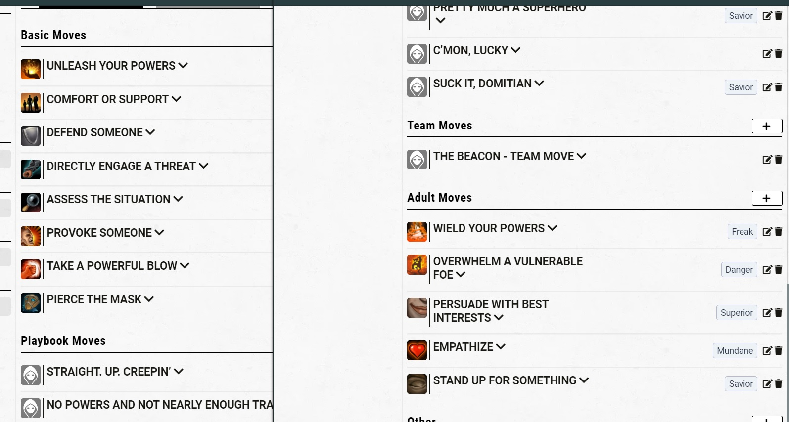
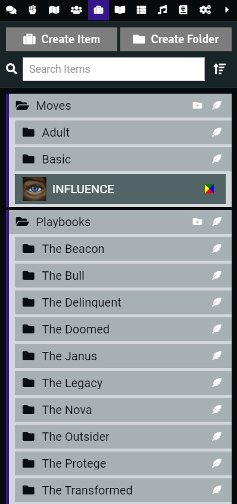

# Masks: A New Generation (unofficial)

Masks: A New Generation moves for PbtA System (https://gitlab.com/asacolips-projects/foundry-mods/pbta). 

The content from this module is from **Masks: A New Generation** from **Magpie Games**. You can get the PDF at: https://magpiegames.com/masks/

## Demonstration

  

  

# Install

## Manual Instalation
1. Go to **modules** and use the link: 
Use this: https://raw.githubusercontent.com/brunocalado/masks-newgeneration-unofficial/main/module.json

# Templates
You need to set up a template before import the compendium. There are two you can use:
- Normal sheet: https://raw.githubusercontent.com/brunocalado/masks-newgeneration-unofficial/main/templates/masks.txt
- Normal sheet + Harm (page 206): https://raw.githubusercontent.com/brunocalado/masks-newgeneration-unofficial/main/templates/masks_harm.txt 

# How To

1. Choose template. Load the template.
2. Activate the module.
3. Import the compendium you want. Right click it and Import all Content.
4. Drag the Folder Basic and Adult to an Actor Sheet.

# Changelog
You can check changes at [CHANGELOG](CHANGELOG.md)

# License
You can check the license of this at page 4 from PDF. 

> The entire text of Masks is released under a Creative Commons Attribution 4.0 International license. https://creativecommons.org/licenses/by/4.0/

The content from this module is from **Masks: A New Generation** from **Magpie Games**. You can get the PDF at: https://magpiegames.com/masks/