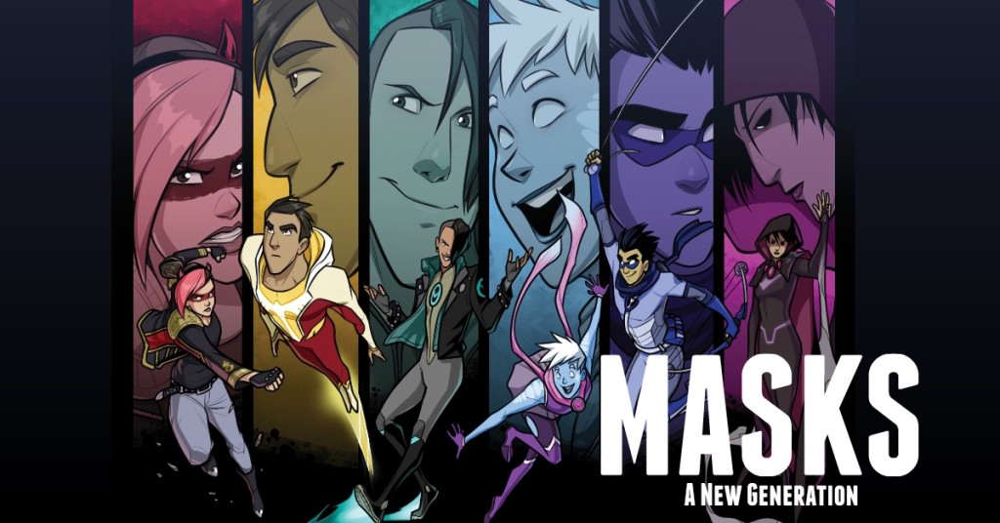

# Masks: A New Generation (Unofficial) Revised

This module contains moves for the game Masks: A New Generation for use with the Foundry VTT generic PbtA System (https://gitlab.com/asacolips-projects/foundry-mods/pbta). You can install this system with this link: https://gitlab.com/asacolips-projects/foundry-mods/pbta/-/jobs/artifacts/beta/raw/system.json?job=build-beta

The content from this module is from **Masks: A New Generation** from **Magpie Games**. You can get the PDF at: https://magpiegames.com/masks/

This revised version of the module is based on the original created by brunocalado (https://github.com/brunocalado/masks-newgeneration-unofficial). In the update, the text of the moves has been slightly rearranged and every move has a custom icon from game-icons.net (https://game-icons.net/).

In addition, Compendium Folders (https://raw.githubusercontent.com/earlSt1/vtt-compendium-folders/master/module.json) is a dependency for this version. If you do not already have Compendium Folders installed, you should be prompted to install it when installing this module.

  

# Install

## Manual Instalation
1. Go to **modules** and use this link: https://raw.githubusercontent.com/CyricPL/masks-newgeneration-unofficial-revised/main/module.json

# Templates
You need to set up a template before import the compendium. There are two you can use:
- Normal sheet: https://raw.githubusercontent.com/CyricPL/masks-newgeneration-unofficial-revised/main/templates/masks.txt
- Harm sheet: https://raw.githubusercontent.com/CyricPL/masks-newgeneration-unofficial-revised/main/templates/masks_harm.txt

# How To

1. Choose a template and load that template in the settings of your PbtA game.
2. Activate the module.
3. Import the compendium you want. Right click it and Import all Content.
4. Drag the Folder Basic and Adult to an Actor Sheet.

# More Instructions
There is a journal with more instructions inside the module. Load the module and search the compendiuns for it.

# Changelog
You can check changes at [CHANGELOG](CHANGELOG.md)

# License
The entire text of Masks is released under a Creative Commons Attribution 4.0 International license. https://creativecommons.org/licenses/by/4.0/
Icons from game-icons.net are released under a Creative Commons Attribution 3.0 Unported license. https://creativecommons.org/licenses/by/3.0/
This work uses material from The Innocent, The Joined, The Newborn, The Reformed, and The Star, published by Magpie Games in the Halcyon City Herald Collection and written by Brendan Conway, Jenn Martin, Tim Franzke and Alberto Muti, June Shores, and Brendan Conway, respectively, and is licensed under the Creative Commons Attribution 4.0 International license. http://creativecommons.org/licenses/by/4.0/
