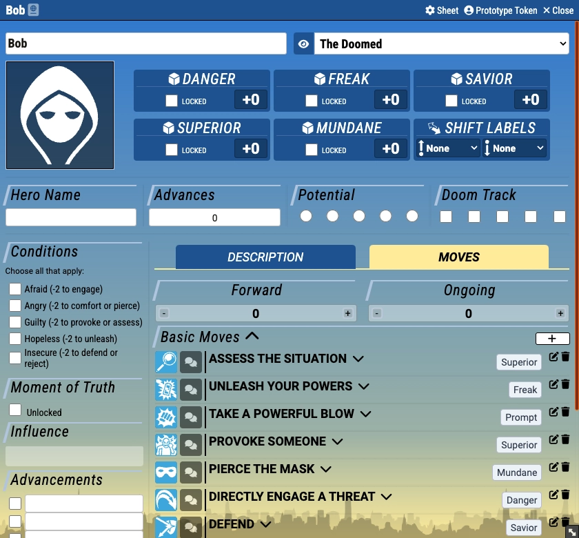
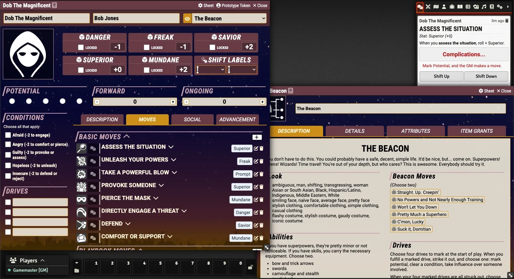
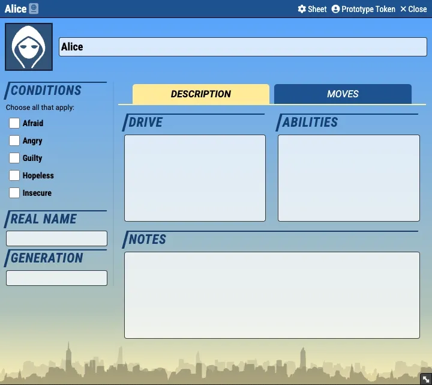

    
     
     
    

     
     
     
    

The content from this module is from **Masks: A New Generation** from **Magpie Games**. You can get the PDF at: https://magpiegames.com/masks/

This revised version of the module is based on works from multiple people: 
- The original created by brunocalado (https://github.com/brunocalado/masks-newgeneration-unofficial) 
- A second version that was maintained by CyricPL (https://github.com/CyricPL/masks-newgeneration-unofficial)
- A sheet module created by Geekswordsman (https://gitlab.com/geekswordsman/masks-newgeneration-sheets)
- Further development and Spanish translation added by erizocosmico
- Continued maintenance through Foundry v14 by philote (ephson)
The current version is a merging of these modules' features, cleanup of the moves and bringing the module up to date with Foundry VTT versions and PbtA system versions.

As of this release, the module is maintained by [ctincorvia](https://github.com/ctincorvia), continuing the project after the previous maintainer became unreachable.

## Screenshots

## Dependencies
The following Foundry VTT game system must be installed to use this module: [Powered by the Apocalypse](https://github.com/asacolips-projects/pbta).

> [!WARNING]
> ### Masks V1.9+
> **ONLY** works with Foundry v14+ and PbtA v1.2.0+
#### If you use Foundry v13:
- use PbtA [v1.1.23](https://github.com/asacolips-projects/pbta/releases/tag/1.1.23) with Masks [v1.8.x](https://github.com/ctincorvia/masks-newgeneration-unofficial/releases)
#### If you use Foundry v12: 
- use PbtA [v1.1.15.2](https://github.com/asacolips-projects/pbta/releases/tag/1.1.15.2) with Masks [v1.7.6](https://github.com/ctincorvia/masks-newgeneration-unofficial/releases/tag/1.7.6)
#### If you use Foundry v11: 
- use PbtA [v0.9.7](https://github.com/asacolips-projects/pbta/releases/tag/0.9.7) with Masks [v1.6.3](https://github.com/ctincorvia/masks-newgeneration-unofficial/releases/tag/1.6.3)

## Features
- PC Character Sheets
- NPC Character Sheets
- Light and Dark designs with a setting to switch them
- Compendium of moves
- Easy Label switching
- Better description fields
- Most playbooks have unique attributes to track, once they are added to the character sheet
- Improved Influences interface
- Automation for playbooks
- Improved layout with Social and Advancement Tabs
- Spanish translation added by https://github.com/erizocosmico
- Team Pool Tracker sheet
- Automatic Mark Potential button when a move result calls for it
- Move picker dialogs for playbook/basic/adult moves, and automatic condition application from move results
- Skips the roll dialog automatically when a move has no choices to make

## TODO
- Add influence to roll dialogs
- Common tracking of who has influence over who
- Figure out how to support the Joined better

# Install

## Module Directory
This module is listed in the Foundry module directory and can be searched and installed within the application.

## Manual Instalation
Go to **modules** and use this link: https://raw.githubusercontent.com/ctincorvia/masks-newgeneration-unofficial/main/module.json

# How To
1. Activate the module.
3. Import the compendium you want. Right click it and Import all Content.
4. Drag the Folder Basic and Adult to an Actor Sheet.

# More Instructions
There is a journal with more instructions inside the module. Load the module and search the compendiums for it.

# License
The entire text of Masks is released under a Creative Commons Attribution 4.0 International license. https://creativecommons.org/licenses/by/4.0/ \
This work uses material from The Innocent, published by Magpie Games in the Halcyon City Herald Collection and written by Brendan Conway, and is licensed under the Creative Commons Attribution 4.0 International license. http://creativecommons.org/licenses/by/4.0/ \
This work uses material from The Joined, published by Magpie Games in the Halcyon City Herald Collection and written by Jenn Martin, and is licensed under the Creative Commons Attribution 4.0 International license. http://creativecommons.org/licenses/by/4.0/ \
This work uses material from The Newborn, published by Magpie Games in the Halcyon City Herald Collection and written by Tim Franzke and Alberto Muti, and is licensed under the Creative Commons Attribution 4.0 International license. http://creativecommons.org/licenses/by/4.0/ \
This work uses material from The Reformed, published by Magpie Games in the Halcyon City Herald Collection and written by June Shores, and is licensed under the Creative Commons Attribution 4.0 International license. http://creativecommons.org/licenses/by/4.0/ \
This work uses material from The Star, published by Magpie Games in the Halcyon City Herald Collection and written by Brendan Conway, and is licensed under the Creative Commons Attribution 4.0 International license. http://creativecommons.org/licenses/by/4.0/ \
This work uses material from The Brain, published by Magpie Games in Secrets of AEGIS and written by Cam Banks, and is licensed under the Creative Commons Attribution 4.0 International license. http://creativecommons.org/licenses/by/4.0/ \
This work uses material from The Soldier, published by Magpie Games in Secrets of AEGIS and written by Mark Diaz Truman, and is licensed under the Creative Commons Attribution 4.0 International license. http://creativecommons.org/licenses/by/4.0/ \
This work uses material from The Harbinger, published by Magpie Games in Masks: Unbound and written by Fred Hicks, and is licensed under the Creative Commons Attribution 4.0 International license. http://creativecommons.org/licenses/by/4.0/ \
This work uses material from The Nomad, published by Magpie Games in Masks: Unbound and written by Brendan Conway, and is licensed under the Creative Commons Attribution 4.0 International license. http://creativecommons.org/licenses/by/4.0/ \
This work uses material from The Scion, published by Magpie Games in Masks: Unbound and written by Brendan Conway, and is licensed under the Creative Commons Attribution 4.0 International license. http://creativecommons.org/licenses/by/4.0/ \
Icons from game-icons.net are released under a Creative Commons Attribution 3.0 Unported license. https://creativecommons.org/licenses/by/3.0/ \
CSS for the light and dark themes came from https://gitlab.com/foundryvtt-mods/masks-newgeneration-sheets
