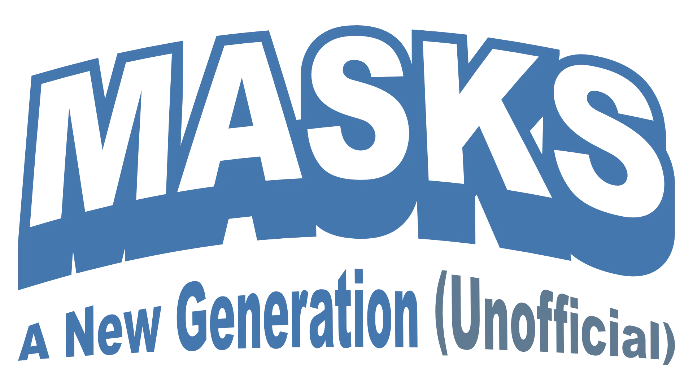

<!--- Forge Bazaar Install % Badge -->

This module contains moves for the game Masks: A New Generation for use with the Foundry VTT generic PbtA System (https://gitlab.com/asacolips-projects/foundry-mods/pbta). You can install this system with this link: https://gitlab.com/asacolips-projects/foundry-mods/pbta/-/jobs/artifacts/beta/raw/system.json?job=build-beta

The content from this module is from **Masks: A New Generation** from **Magpie Games**. You can get the PDF at: https://magpiegames.com/masks/

This revised version of the module is based on works from multiple people: 
- The original created by brunocalado (https://github.com/brunocalado/masks-newgeneration-unofficial) 
- A second version that was maintained by CyricPL (https://github.com/CyricPL/masks-newgeneration-unofficial)
- A sheet module created by Geekswordsman (https://gitlab.com/geekswordsman/masks-newgeneration-sheets)
The current version is a merging of these modules' features, cleanup of the moves and bringing the module up to date with Foundry VTT versions and PbtA system versions.

## Features
- PC Character Sheets
- NPC Character Sheets
- Light and Dark designs with a setting to switch them
- Compendium of moves
- Easy Label switching
- Better description fields
- Most playbooks have unique attributes to track, once they are added to the character sheet
- Improved Influences interface

## TODO
- Team Pool Tracker

# Install

## Module Directory
This module is listed in the Foundry module directory and can be searched and installed within the application.

## Manual Instalation
Go to **modules** and use this link: https://raw.githubusercontent.com/CyricPL/masks-newgeneration-unofficial-revised/main/module.json

# How To

1. Activate the module.
3. Import the compendium you want. Right click it and Import all Content.
4. Drag the Folder Basic and Adult to an Actor Sheet.

# More Instructions
There is a journal with more instructions inside the module. Load the module and search the compendiums for it.

# Changelog
You can check changes at [CHANGELOG](CHANGELOG.md)

# License
The entire text of Masks is released under a Creative Commons Attribution 4.0 International license. https://creativecommons.org/licenses/by/4.0/
This work uses material from The Innocent, published by Magpie Games in the Halcyon City Herald Collection and written by Brendan Conway, and is licensed under the Creative Commons Attribution 4.0 International license. http://creativecommons.org/licenses/by/4.0/
This work uses material from The Joined, published by Magpie Games in the Halcyon City Herald Collection and written by Jenn Martin, and is licensed under the Creative Commons Attribution 4.0 International license. http://creativecommons.org/licenses/by/4.0/
This work uses material from The Newborn, published by Magpie Games in the Halcyon City Herald Collection and written by Tim Franzke and Alberto Muti, and is licensed under the Creative Commons Attribution 4.0 International license. http://creativecommons.org/licenses/by/4.0/
This work uses material from The Reformed, published by Magpie Games in the Halcyon City Herald Collection and written by June Shores, and is licensed under the Creative Commons Attribution 4.0 International license. http://creativecommons.org/licenses/by/4.0/
This work uses material from The Star, published by Magpie Games in the Halcyon City Herald Collection and written by Brendan Conway, and is licensed under the Creative Commons Attribution 4.0 International license. http://creativecommons.org/licenses/by/4.0/
This work uses material from The Brain, published by Magpie Games in Secrets of AEGIS and written by Cam Banks, and is licensed under the Creative Commons Attribution 4.0 International license. http://creativecommons.org/licenses/by/4.0/
This work uses material from The Soldier, published by Magpie Games in Secrets of AEGIS and written by Mark Diaz Truman, and is licensed under the Creative Commons Attribution 4.0 International license. http://creativecommons.org/licenses/by/4.0/
This work uses material from The Harbinger, published by Magpie Games in Masks: Unbound and written by Fred Hicks, and is licensed under the Creative Commons Attribution 4.0 International license. http://creativecommons.org/licenses/by/4.0/
This work uses material from The Nomad, published by Magpie Games in Masks: Unbound and written by Brendan Conway, and is licensed under the Creative Commons Attribution 4.0 International license. http://creativecommons.org/licenses/by/4.0/
This work uses material from The Scion, published by Magpie Games in Masks: Unbound and written by Brendan Conway, and is licensed under the Creative Commons Attribution 4.0 International license. http://creativecommons.org/licenses/by/4.0/
Icons from game-icons.net are released under a Creative Commons Attribution 3.0 Unported license. https://creativecommons.org/licenses/by/3.0/
back-forth.svg created by Lorc under CC BY 3.0, available through https://game-icons.net
CSS for the light and dark themes came from https://gitlab.com/foundryvtt-mods/masks-newgeneration-sheets
